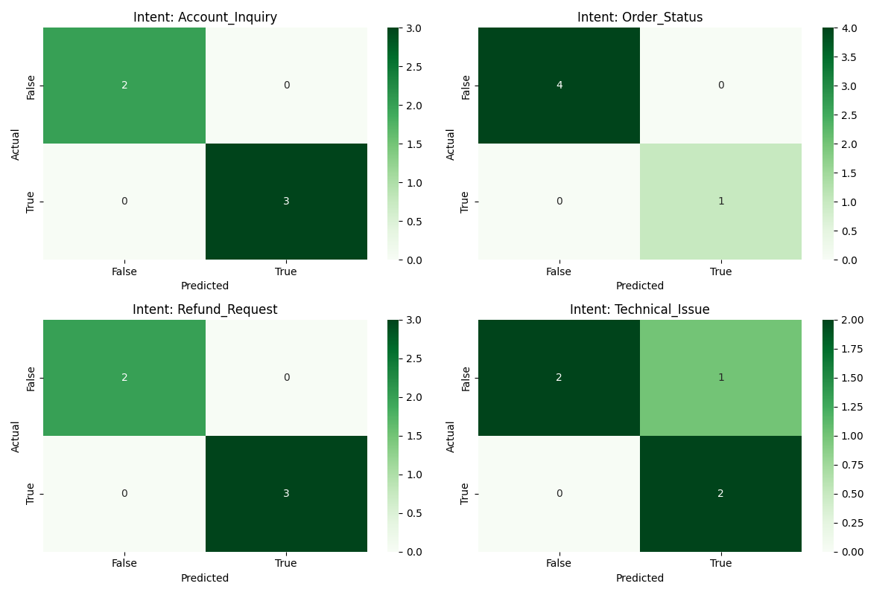

# Support Intent Classifier: Few-Shot Prompting with Chain-of-Thought

<p align="center">
  
</p>

**Tech Stack:** `Python 3.10+` | `OpenAI GPT-4o-mini` | `Scikit-Learn` | `Seaborn/Matplotlib`

---

## Project Overview
This repository demonstrates a production-grade approach to **Intent Classification** within the high-entropy environment of customer support.
It is a specialized NLP pipeline designed to classify complex, multi-turn customer support dialogues. This project leverages **Few-Shot prompting** and **Chain-of-Thought (CoT) reasoning** to navigate the "messiness" of human-to-human interaction, such as slang, typos, and mid-conversation intent pivots.

In a real-world support environment (inspired by my experience as an IT Aide), users rarely present a single, simple request. They often report a bug, change their mind, or ask a second question in the same breath. This classifier uses a **reasoning step** to decompose these dialogues into discrete propositions before mapping them to specific labels.

## Technical Features
* **Contextual Turn-Taking:** Specifically engineered templates that distinguish between Agent and Customer roles to maintain state.
* **Multi-Label Architecture:** Capable of identifying multiple overlapping intents (e.g., `Technical_Issue` + `Refund_Request`) in a single string.
* **Linguistic Audit:** Includes a performance evaluation suite using `scikit-learn` to identify where discourse markers (like "never mind") cause model over-labeling.

## Performance Metrics
The system generates a **Multi-Label Confusion Matrix** (shown above) to audit the precision and recall of each intent independently. 

* **Current Focus:** Refining precision on `Technical_Issue` by improving the model's handling of intent resolution markers.

## Installation & Setup

1.  **Clone the Repository:**
    ```bash
    git clone <support-intent-classifier-cot>
    cd support-intent-classifier
    ```

2.  **Environment Setup:**
    ```bash
    python3 -m venv venv
    source venv/bin/activate
    pip install -r requirements.txt
    ```

3.  **Run the Pipeline:**
    Create a `.env` file with your `OPENAI_API_KEY` and execute:
    ```bash
    python3 classifier.py
    ```

## Project Structure
* `classifier.py`: The core logic, API integration, and visualization suite.
* `dataset.json`: A curated validation set of 5 "high-difficulty" support edge cases.
* `requirements.txt`: Project dependencies (OpenAI, Scikit-Learn, Seaborn, Matplotlib).